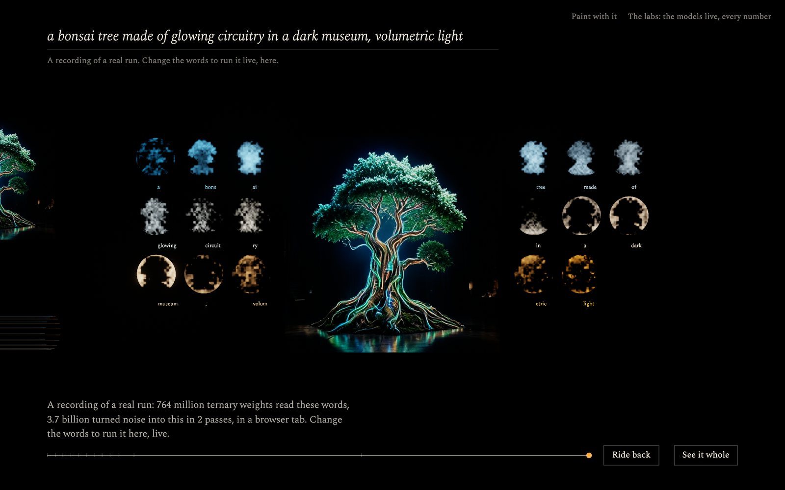
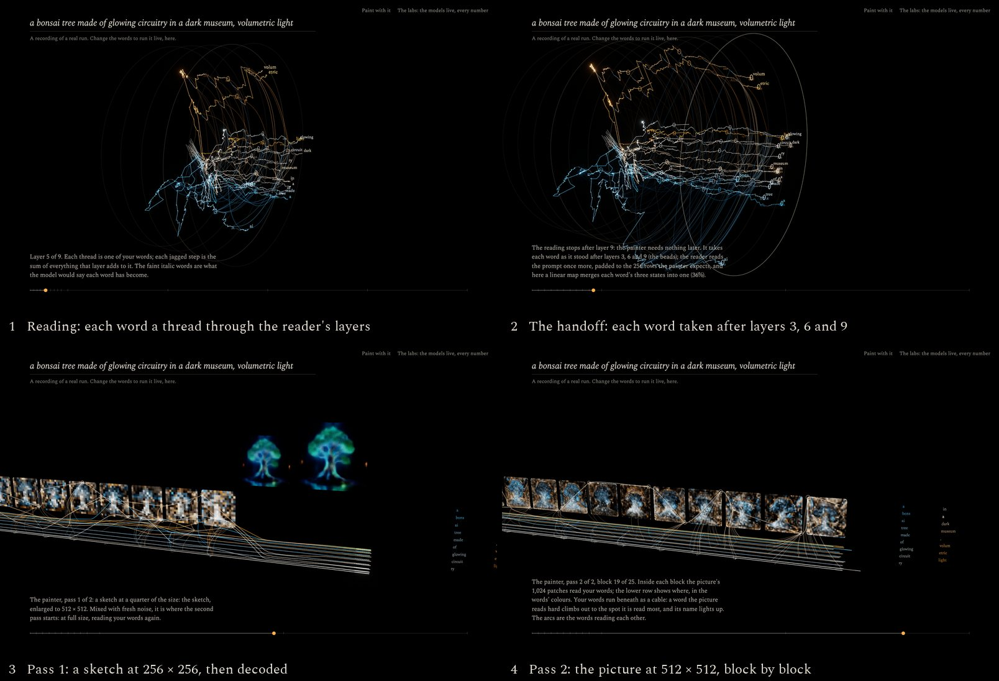
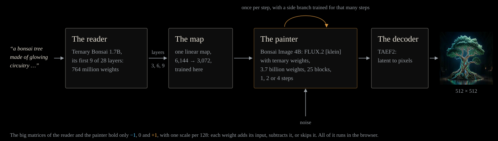
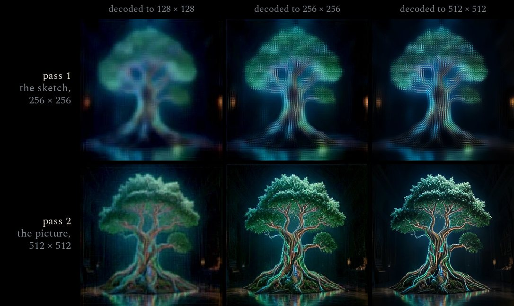
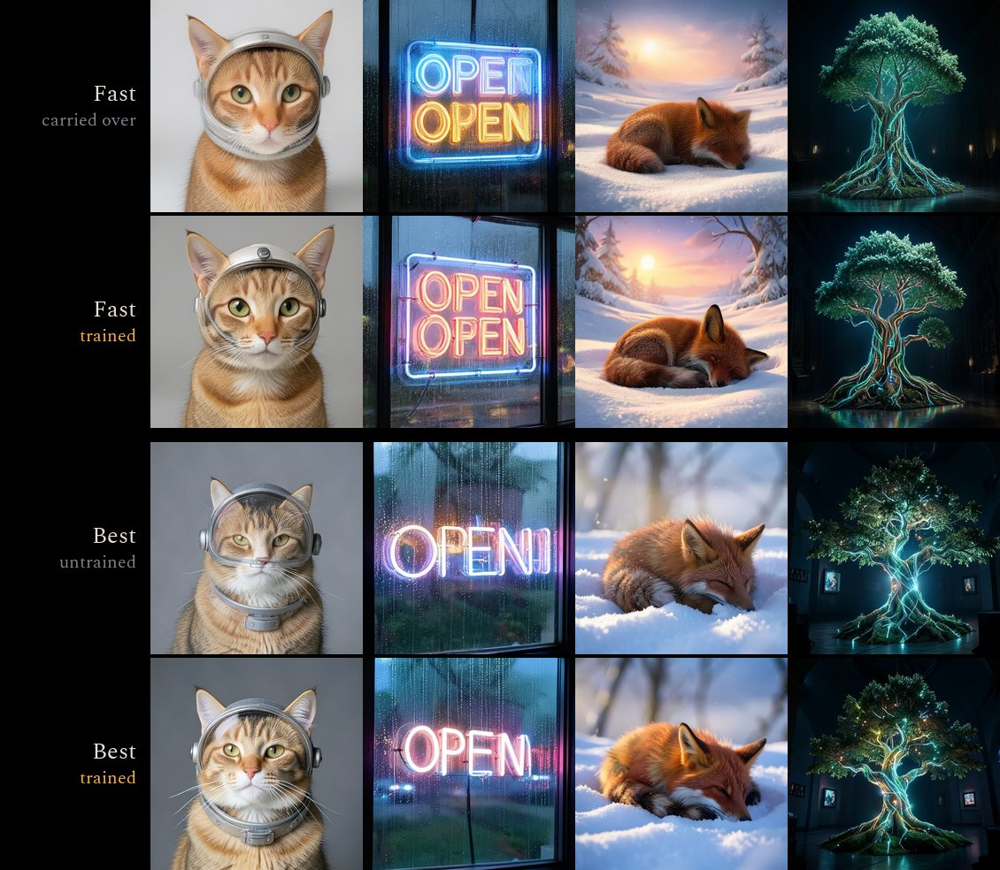
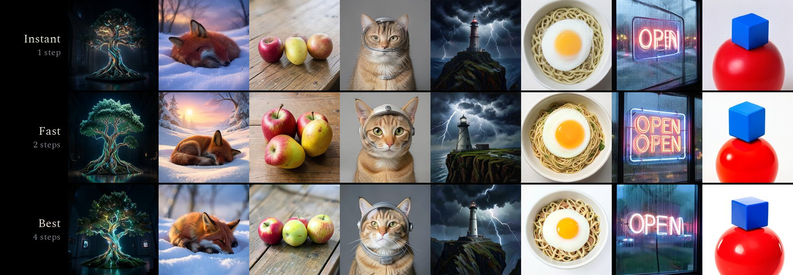
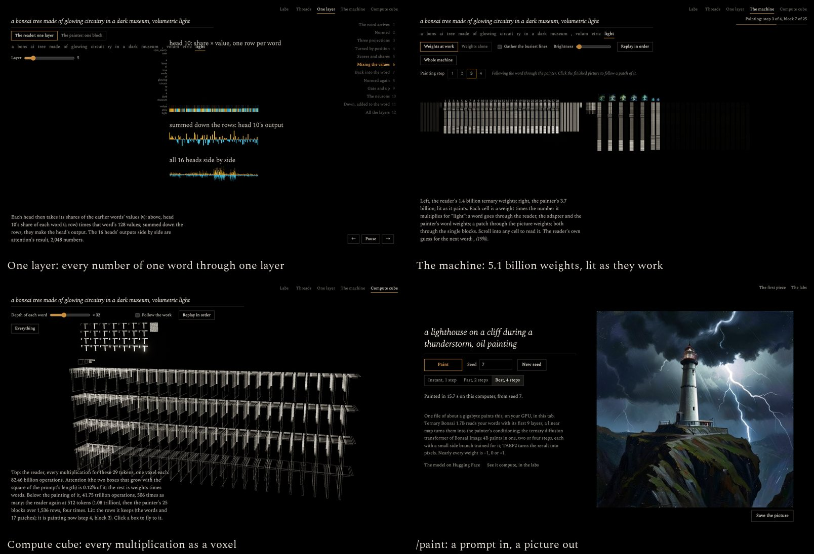
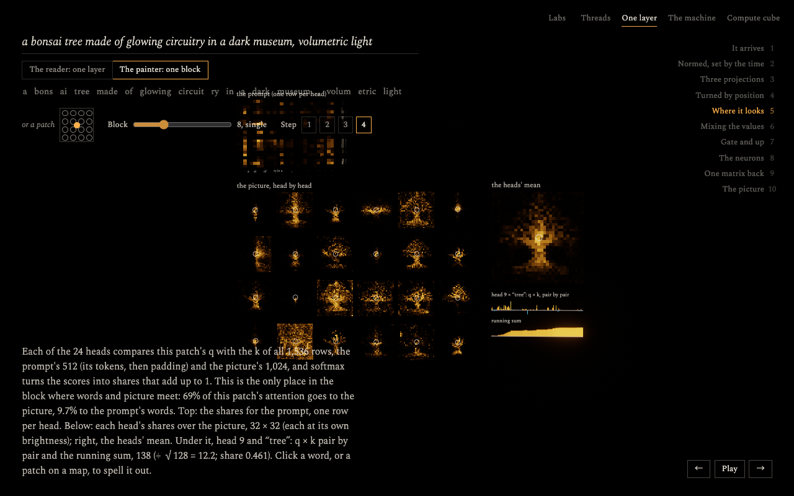

# mindview

mindview is an art installation that runs two neural networks in your browser and shows them working. A language
model reads your words and a diffusion model paints them, and you watch every layer do it: each word travels as a
thread through the reader's layers, then the painter reads the words, block by block, as the picture forms. Nothing on
screen is illustration. Every line, map and picture is drawn from numbers the models computed.

Both networks are ternary: nearly all of their weights are −1, 0 or +1. To make the piece open fast and paint in a few
seconds, we packed the whole text-to-image pipeline into one file of about a gigabyte,
[mindview-t2i-turbo](https://huggingface.co/mohsenvand/mindview-t2i-turbo), and trained small side branches so that it
paints in one, two or four steps. On a MacBook Air (M4) a picture takes about 4, 6 or 15 seconds.

**Live:** [neovand.github.io/mindview](https://neovand.github.io/mindview/) ·
[paint](https://neovand.github.io/mindview/paint) · [the labs](https://neovand.github.io/mindview/lab) ·
[the model](https://huggingface.co/mohsenvand/mindview-t2i-turbo)



## What you see

The landing asks for a prompt and waits for you to start. Then it follows your words through both models, in the
order the computation happens.



1. **Reading.** Each word of the prompt is a thread through the reader's layers. A layer moves a word by a sum: one
   term for each attention head reading each earlier word, one for each of 6,144 neurons. The thread is drawn through
   that sum term by term, so every vertex is a real partial sum and every jagged step lands exactly where the word is
   after that layer. The faint italic words are what the model would say each word has become (the logit lens).
2. **The handoff.** The painter needs each word only as it stands after layers 3, 6 and 9 (the beads), so the reader
   stops there. A linear map merges each word's three states into the painter's conditioning.
3. **The sketch.** The painter's first pass paints at a quarter of the size. Each block's reading shows where the
   picture's patches read each word, in the word's colour; the words run beneath as a cable, and a word the picture
   reads hard climbs out to where it is read most. Then the sketch goes through the decoder.
4. **The picture.** The second pass paints at full size, starting from the sketch, reading the words again. At the
   end, the finished picture stands with each word's reading, averaged over every block, around it.

You can drag to turn, scroll to come closer, ride back along the timeline, or type a new prompt at any time.

The opening prompt plays a **recording** of a real run: what the models computed, read back from the GPU during a live
run and stored as numbers (about 5 MB). It is drawn exactly as a live run is, and the page says that it is a recording.
Change the words and the models download once (1.2 GB, kept by the browser) and run live in your tab.

## How it works



1. **The reader:** [Ternary Bonsai 1.7B](https://huggingface.co/prism-ml/Ternary-Bonsai-1.7B-gguf) by PrismML, a
   language model with 28 layers. It reads the prompt.
2. **The map:** a linear map we trained. It takes each word's state from three of the reader's layers and turns it
   into the painter's conditioning, in place of the 4B text encoder the painter was trained with.
3. **The painter:** the diffusion transformer of
   [Bonsai Image 4B](https://huggingface.co/prism-ml/bonsai-image-ternary-4B-unpacked), which is FLUX.2 [klein] 4B with
   ternary weights. It has 5 double blocks and 20 single blocks and runs over the prompt's rows and the picture's 1,024
   patches, a few steps from noise.
4. **The decoder:** [TAEF2](https://huggingface.co/madebyollin/taef2), a tiny autoencoder that turns the latent into a
   512 × 512 picture.

A ternary weight is −1, 0 or +1, with one scale shared by 128 weights. So the models never multiply by their weights:
each weight adds its input, subtracts it or skips it. All of it runs in the browser, on WebGPU, with no server. The
painter in the browser matches PyTorch block for block, with cosine 1.000000.

The landing and `/paint` run the one-file model: the reader cut to 9 layers, the map from layers 3, 6 and 9, and the
trained side branches. The labs run the full pipeline, because they show all of it: the whole reader, a ternary
adapter from layers 7, 14 and 21, and the painter in four steps with a per-block lens, a small readout that shows the
picture each block has in mind.

## Making it small and fast

The labs' pipeline downloads about 1.6 GB and paints in four steps. Most of the work below went into the one-file
model, so that the landing and `/paint` start quickly and paint in seconds.

**Fewer layers.** A sweep over which reader layers to tap (`research/scripts/adapter_layers.py`) found that shallow
layers condition the painter about as well as deep ones. A map from layers 3, 6 and 9 scores a per-token cosine of
0.959 against the stock text encoder, measured in the painter's input space on held-out prompts; the labs' adapter,
which reads layers 7, 14 and 21, scores 0.952. Every layer the map does not read is a layer the file does not carry, so
the file keeps 9 of the reader's 28 layers. The map and the painter's context embedder are both linear, so they are
stored as one matrix (6,144 → 3,072).

**Fewer steps.** Two fine-tunes of the original klein carry over to the ternary painter as small side branches,
y = W x + B (A x), on its 100 big matrices. radames'
[SANA-Sprint LoRA](https://huggingface.co/radames/FLUX.2-klein-Sana-Sprint) paints in two steps, and its best rank-8
approximation paints like the full rank 256 (`lora_steps.py`, `lora_compress.py`). EPFL's
[RDM](https://huggingface.co/epfl-vita/flux2-klein-1step-rdm) paints in one step; its change to klein carries over at
rank 4, with the modulation recomputed at σ = 1 (`rdm_delta.py`, `rdm_test.py`, `rdm_rank.py`).

**A sketch first.** With two steps, the picture is still 88% noise after the first, so the first step only has to
place things. Fast runs it at 256 × 256 on the first 128 text rows, enlarges its guess of the clean picture in latent
space, noises it back and paints the second step at 512 × 512. That takes a third less time, and the pictures are as
good (`progressive.py`, `progressive_rows.py`). The decoder's stages of both passes, from the landing's recording:



**Training the shortcuts on the ternary painter.** Carried over, the side branches painted softly and with defects (in
one step, a cat's face came out doubled), and even four plain steps of the ternary painter drifted from klein's (a sign
read "OPENI"). RDM on the full-precision klein paints sharply from the same conditioning, so the gap is the ternary
weights. So we trained a branch for each mode on the ternary painter itself, with a full-precision teacher:

- Instant: RDM on klein, one step. Fast: klein with the SANA-Sprint LoRA, run exactly as Fast runs. Best: klein itself,
  four steps.
- The student is the ternary painter with a rank-32 branch and learned offsets on each step's modulation. At every step
  it starts from the teacher's own noisy picture and learns the teacher's guess of the clean one.
- The loss is LPIPS between the two guesses, decoded by TAEF2 as the browser decodes them, plus a little mean squared
  error. Mean squared error alone made the pictures blurrier while lowering the error: where the student cannot match
  the teacher's detail, it averages.
- 2,000 prompts, 3,000 steps, on one H100 at [Modal](https://modal.com), 20 to 25 minutes per mode
  (`distill_1step.py`, `distill_steps.py`, `research/cloud/distill_modal.py`).

| Mode    | Teacher               | Held-out LPIPS to the teacher, before → after |
| ------- | --------------------- | --------------------------------------------- |
| Instant | RDM on klein, 1 step  | 0.454 → 0.381                                 |
| Fast    | klein + LoRA, 2 steps | 0.496 → 0.419                                 |
| Best    | klein, 4 steps        | 0.448 → 0.370                                 |



**Fast in the browser.** An f16 ternary matrix multiply (tiles staged and multiplied in f16, summed in f32), attention
in f16, the text stream cut to what the prompt needs, a register-tiled decoder, and one GPU scheduler that feeds the
work a few milliseconds per frame, so the page stays smooth while the models run. `/dev/gemm`, `/dev/profile` and
`/dev/rows` (development only) measure them.

**One file.** Ternary weights are stored 5 to a byte (1.6 bits each). Tensors are deflated wherever that saves
anything, and the browser inflates them. The file is read with range requests, in parts, so it is never all in memory
at once, and the reader (the first part) starts reading while the painter is still downloading.

| Part                               | Stored   |
| ---------------------------------- | -------- |
| The reader: 9 layers and tokenizer | 158.4 MB |
| The map                            | 35.3 MB  |
| The painter                        | 761.3 MB |
| The decoder                        | 2.5 MB   |
| The 1-step branch (rank 32)        | 82.7 MB  |
| The 2-step branch (rank 32)        | 82.6 MB  |
| The 4-step branch (rank 32)        | 82.6 MB  |
| Schedules for 1–4 steps            | 2.1 MB   |
| **Total**                          | 1,208 MB |

The result, the same prompts and seed in each mode, painted in the browser:



| Mode    | Steps | Time for a first picture (MacBook Air M4, Chrome) |
| ------- | ----- | ------------------------------------------------- |
| Instant | 1     | about 4 s                                         |
| Fast    | 2     | about 6 s                                         |
| Best    | 4     | about 15 s                                        |

Best is the most faithful to the prompt. Fast has the most detail but sometimes repeats things. Instant is a little
softer. The Air has no fan and slows by about a third after minutes of painting.

## What you can open



| Page                                                             | What it is                                                                                                                                                                                                                                                                                                                                           |
| ---------------------------------------------------------------- | ---------------------------------------------------------------------------------------------------------------------------------------------------------------------------------------------------------------------------------------------------------------------------------------------------------------------------------------------------- |
| [`/`](https://neovand.github.io/mindview/)                       | The landing: your words as threads through the reader's layers, then into the painter, a sketch and then the picture. The opening prompt plays a recording of a real run; any other prompt runs the one-file model live in your tab.                                                                                                                 |
| [`/paint`](https://neovand.github.io/mindview/paint)             | Type a prompt and get a picture, in one, two or four steps, from the one-file model.                                                                                                                                                                                                                                                                 |
| [`/lab/threads`](https://neovand.github.io/mindview/lab/threads) | The landing's piece on the full pipeline: the reader's layers up to 21, then the painter in four steps, with the picture each block has in mind.                                                                                                                                                                                                     |
| [`/lab/layer`](https://neovand.github.io/mindview/lab/layer)     | Operation by operation, every number readable. Pick one layer of the reader, or one block of the painter (for a word or a patch of the picture). You see the norms, the projections with their running sums, the rotary turns, attention (in the painter, 24 heads over the prompt and all 1,024 patches), the neurons, and the gated residual adds. |
| [`/lab/machine`](https://neovand.github.io/mindview/lab/machine) | All 5.1 billion weights (the reader's 1.4 billion, the painter's 3.7 billion) on one wall, one cell each, lit by what they multiply for the word or patch you follow. The picture each block has in mind sits above it, filling in as it paints.                                                                                                     |
| [`/lab/cube`](https://neovand.github.io/mindview/lab/cube)       | Every multiplication as a voxel: the reading, then the painting below it, which takes hundreds of times more operations.                                                                                                                                                                                                                             |



## Running it

You need:

- A browser with WebGPU: a recent Chrome or Edge. It is developed and tested in Chrome on an Apple M4.
- A GPU with about 3 GB to spare.
- Room for the downloads on the first visit: 1.2 GB for a live run on the landing or for `/paint`, about 1.6 GB for
  the labs. The browser keeps them in Cache Storage for later visits.

To run it locally:

```sh
pnpm install
pnpm dev
```

By default the models come from Hugging Face, the same as on the live site. To work from local copies (faster reloads,
no network), put them in `static/models` and they are used instead:

```sh
hf download prism-ml/Ternary-Bonsai-1.7B-gguf Ternary-Bonsai-1.7B-Q2_0.gguf --local-dir /tmp/reader
mkdir -p static/models/ternary-bonsai-1.7b
mv /tmp/reader/Ternary-Bonsai-1.7B-Q2_0.gguf static/models/ternary-bonsai-1.7b/model.gguf
hf download mohsenvand/mindview-painter --local-dir static/models/bonsai-image-4b
hf download mohsenvand/mindview-t2i-turbo mindview-t2i-turbo.gguf --local-dir /tmp/t2i
mkdir -p static/models/mindview-t2i
mv /tmp/t2i/mindview-t2i-turbo.gguf static/models/mindview-t2i/model.gguf
```

`MODELS=hub` or `MODELS=local` forces one or the other (see `vite.config.ts` and `src/lib/models.ts`).

Other commands:

- `pnpm check`: type-check.
- `pnpm lint`: formatting and lint.
- `pnpm build`: build the static site into `build/`. Set `BASE_PATH=/mindview` to serve it from a folder.

<details>
<summary>Rebuilding the one-file model</summary>

After `research/scripts/adapter.py targets`, which runs the stock encoder over the prompts:

```sh
research/.venv/bin/python research/scripts/adapter_layers.py stats
research/.venv/bin/python research/scripts/adapter_layers.py fit
research/.venv/bin/python research/scripts/adapter_layers.py final 3 6 9
research/.venv/bin/python research/scripts/pack_model.py --fused research/data/adapter/fused_final_layers_3_6_9.pt --float \
  --lora research/data/distill/fast_trained_r32.safetensors --lora-rank 32 \
  --fast-offsets research/data/distill/fast_offsets.pt \
  --best research/data/distill/best_trained_r32.safetensors --best-rank 32 \
  --best-offsets research/data/distill/best_offsets.pt \
  --rdm research/data/distill/rdm_trained_r32.safetensors --rdm-rank 32
```

The 1-step branch needs, first: `research/scripts/rdm_delta.py` (RDM minus klein, as rank-256 SVDs), the training
(`distill_1step.py prepare`, then `modal run research/cloud/distill_modal.py --step upload|fetch|targets|train|pull`,
then `distill_1step.py export 32`), and `RDM_STUDENT=research/data/distill/student_r32.pt
export_painter_schedules.py` (the `1r` schedule with the trained offsets). The 2- and 4-step branches: `modal run
research/cloud/distill_modal.py --script steps --mode fast|best --step targets|train`, then `--step pull --only fast_`
(or `best_`) and `distill_steps.py export fast|best 32`.

The landing's recorded run is made with `node research/scripts/record_threads.mjs` (with `pnpm dev` running): it runs
the opening prompt live on the local file in headless Chrome and writes `static/recordings/bonsai-museum`.

The pages `/lab/pack` and `/lab/pack/grid` compare the file's pictures with the reader's and painter's own files.

</details>

## How it is built

- `src/lib/runtime/`: the WebGPU runtime. It holds a GGUF reader, the ternary matrix kernels, the reader, the
  painter, TAEF2, and one GPU scheduler that feeds work to the GPU a few milliseconds per frame.
- `src/lib/viz/`: the threads piece (`threads.ts` for the reader, `painting.ts` for the painter, `recording.ts` for
  recorded runs). `src/lib/landing/` loads the one-file model for it.
- `src/lib/lab/`: the labs. They share one stage (camera, bloom) and one panel renderer that draws matrices and
  vectors straight from GPU buffers at any zoom, down to a single printed number. They also share one painting,
  which keeps every matrix input for the prompt's words and 17 patches.
- `src/lib/engine/`: shared drawing: the GPU setup, bloom, text and words.
- `research/`: the Python side, which:
  - exports the painter's files (`export_painter.py`, `export_painter_schedules.py`, `export_painter_viz2.py`);
  - trains the adapter (`adapter.py`, `adapter_ternarize.py`);
  - fits the map for the one-file model and packs it (`adapter_layers.py`, `pack_model.py`);
  - trains the side branches (`distill_1step.py`, `distill_steps.py`, on Modal with `cloud/distill_modal.py`);
  - fits the lens (`tuned_lens.py`);
  - checks the browser runtime against PyTorch (`painter_reference.py`, `painter_truth.py`).

## Deploying

`.github/workflows/deploy.yml` builds the site on every push to `main` and publishes it on GitHub Pages
(Settings → Pages → Source: GitHub Actions). The site is static; the models are fetched from Hugging Face.

## Credits

- [PrismML](https://huggingface.co/prism-ml): the Bonsai models. Ternary Bonsai 1.7B and Bonsai Image 4B are
  Apache 2.0.
- [Black Forest Labs](https://huggingface.co/black-forest-labs/FLUX.2-klein-4B): FLUX.2 [klein] 4B, the painter's
  architecture and the teacher for the side branches (Apache 2.0).
- [Ollin Boer Bohan](https://huggingface.co/madebyollin/taef2): TAEF2 (MIT).
- [radames](https://huggingface.co/radames/FLUX.2-klein-Sana-Sprint): the 2-step LoRA, the start of the 2-step branch
  (Apache 2.0).
- [EPFL VITA](https://huggingface.co/epfl-vita/flux2-klein-1step-rdm): RDM, the 1-step fine-tune and the teacher for the
  1-step branch (Apache 2.0).
- The painter bundle on Hugging Face ([mohsenvand/mindview-painter](https://huggingface.co/mohsenvand/mindview-painter))
  repackages those weights for the browser, together with the adapter and the lens trained here.
  [mohsenvand/mindview-t2i-turbo](https://huggingface.co/mohsenvand/mindview-t2i-turbo) packs them, with the map and
  the side branches trained here, into one file.
